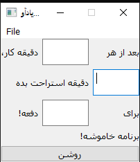

# Little pomodoro
> A pomodoro app for increase productivity.




## Setup
1. Clone this repo in your local dir.

2. Head to repo dir, then in your terminal:
```sh
python main.py
```


## Modules you should have in pip list

- playsound
- PyQt5
- PyQt5.QtWidgets
- PyQt5.QtCore
- PyQt5.QtWebEngineWidgets
- OR use Anaconda env